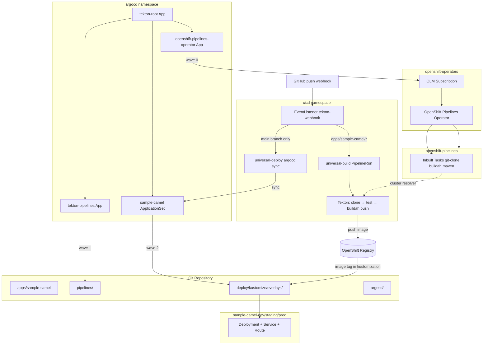

# OpenShift Pipelines — Reusable CI/CD for Camel and Multi-Language Apps

Repository: [github.com/rmallam/openshift-pipelines-examples](https://github.com/rmallam/openshift-pipelines-examples.git)

**Design principle:** pipelines reference only inbuilt OpenShift Pipelines tasks via the cluster resolver — no custom Task CRs.

## Architecture



| Layer | Tool | Responsibility |
|-------|------|----------------|
| **Operator** | Argo CD → OLM Subscription | Installs OpenShift Pipelines operator + inbuilt tasks |
| **Trigger** | Tekton EventListener | GitHub webhook → PipelineRun on push |
| **Build** | Tekton `universal-build` | Clone, test, build image, push to registry |
| **Deploy (GitOps)** | Argo CD ApplicationSet | Sync kustomize overlays per environment |
| **Dev deploy trigger** | Tekton → Argo CD sync | `main` branch push → sync `sample-camel-dev` only |
| **Pipeline infra** | Argo CD Application | GitOps-manage Pipeline/RBAC/PVC/triggers in `cicd` ns |

**Full install guide:** [docs/INSTALL.md](docs/INSTALL.md)

## Repository layout

```
apps/sample-camel/              # Sample Camel Quarkus REST app
deploy/
  plain-yaml/                   # Per-environment YAML manifests
  kustomize/                    # Base + dev/staging/prod overlays (used by Argo CD)
  helm/sample-camel/            # Helm chart with per-env values files
pipelines/
  kustomization.yaml            # What Argo CD syncs (excludes PipelineRuns)
  universal-build-pipeline.yaml
  universal-deploy-pipeline.yaml
  rbac/                         # ServiceAccount and RBAC
  pvc/                          # Workspace PVC
  pipelineruns/                 # Example PipelineRuns (not GitOps-synced)
  triggers/                     # EventListener, bindings, templates, Route
operators/
  openshift-pipelines/          # OLM Subscription (installed by Argo CD)
argocd/
  root-application.yaml         # Bootstrap App-of-Apps (apply once)
  rbac/argocd-olm.yaml          # One-time RBAC for operator install via Argo CD
  app-project/tekton-project.yaml
  applications/openshift-pipelines-operator.yaml
  applications/tekton-pipelines.yaml
  applicationsets/sample-camel.yaml
docs/
  INSTALL.md                    # End-to-end installation guide
scripts/
  verify-install.sh             # Post-install verification (cluster)
  ci-validate.sh                # Manifest validation (local/CI)
.github/
  workflows/ci.yaml             # GitHub Actions CI
config/
  operators.yaml                # Operator channel reference
  environments.yaml             # Environment parameter reference
  argocd.yaml                   # Argo CD settings reference
  argocd-token-secret.example.yaml
  triggers.yaml                 # Webhook trigger rules reference
  github-webhook-secret.example.yaml
.cursor/rules/
```

## Prerequisites

- OpenShift 4.x cluster with **cluster-admin** for bootstrap
- **Argo CD already installed** (`argocd` or OpenShift GitOps namespace)
- `oc` CLI logged in
- Optional: `tkn` CLI, `argocd` CLI

The OpenShift Pipelines operator is **installed by this repo via Argo CD** — you do not need to install it manually from OperatorHub.

## Quick start

See **[docs/INSTALL.md](docs/INSTALL.md)** for the complete end-to-end guide. Summary:

```bash
# 1. Grant Argo CD OLM permissions (once, cluster-admin)
oc apply -f argocd/rbac/argocd-olm.yaml

# 2. Bootstrap everything via Argo CD
oc apply -f argocd/root-application.yaml

# 3. Wait for operator, then create secrets + GitHub webhook (see INSTALL.md)

# 4. Verify
./scripts/verify-install.sh
```

### What Argo CD installs (sync waves)

| Wave | Argo CD app | Delivers |
|------|-------------|----------|
| 0 | `openshift-pipelines-operator` | OLM Subscription → operator → `openshift-pipelines` ns |
| 1 | `tekton-pipelines` | Pipelines, triggers, RBAC, PVC → `cicd` ns |
| 2 | `sample-camel-dev/staging/prod` | Workload manifests → env namespaces |

### 1. Bootstrap (detail)

After `oc apply -f argocd/root-application.yaml`, check status:

```bash
argocd app list
argocd app get openshift-pipelines-operator
argocd app get tekton-pipelines
argocd app get sample-camel-dev
```

**Prod** uses manual sync (no auto-sync). Dev and staging auto-sync on Git changes.

### 2. Configure GitHub webhooks (automatic build + dev deploy)

Create secrets in the `cicd` namespace (not synced from Git):

```bash
# Webhook HMAC secret (use the same value in GitHub webhook settings)
oc create secret generic github-webhook-secret \
  --from-literal=secretToken=$(openssl rand -hex 20) \
  -n cicd

# Argo CD API token for dev deploy trigger
oc create secret generic argocd-token \
  --from-literal=token=<argocd-api-token> \
  -n cicd
```

Get the webhook URL after triggers are synced:

```bash
oc get route tekton-webhook -n cicd -o jsonpath='https://{.spec.host}{"\n"}'
```

In GitHub → **Settings → Webhooks → Add webhook**:

| Field | Value |
|-------|-------|
| Payload URL | `https://tekton-webhook-....apps.<cluster>` |
| Content type | `application/json` |
| Secret | same as `secretToken` above |
| Events | **Just the push event** |

#### What fires automatically

| Trigger | Branch | Paths | Action |
|---------|--------|-------|--------|
| `sample-camel-build` | any | `apps/sample-camel/**` | Run `universal-build` (clone → maven test → buildah push) |
| `sample-camel-dev-deploy` | `main` only | `apps/sample-camel/**` or `deploy/kustomize/overlays/dev/**` | Argo CD sync `sample-camel-dev` |

Staging and prod are **not** webhook-triggered — promote via PR to their overlays or manual sync.

See `config/triggers.yaml` for the full rule reference.

### 3. Manual pipeline install (alternative to Argo CD)

```bash
export NS=cicd

oc create namespace "${NS}" --dry-run=client -o yaml | oc apply -f -
oc apply -k pipelines/ -n "${NS}"
```

For cross-namespace deployment:

```bash
oc apply -f pipelines/rbac/pipeline-runner-cluster.yaml
```

### 4. Build the sample Camel app (manual)

```bash
oc create -f pipelines/pipelineruns/sample-camel-build-dev.yaml -n cicd
```

### 5. Deploy via Argo CD (recommended)

After build, bump the image tag in `deploy/kustomize/overlays/dev/kustomization.yaml` and push to Git. Argo CD auto-syncs dev.

Or trigger an immediate sync from Tekton:

```bash
# Create argocd-token secret first (see config/argocd-token-secret.example.yaml)
oc create -f pipelines/pipelineruns/sample-camel-sync-argocd-dev.yaml -n cicd
```

### 6. Deploy via Tekton directly (alternative)

```bash
oc create -f pipelines/pipelineruns/sample-camel-deploy-dev-kustomize.yaml -n cicd
```

## Argo CD applications

### tekton-pipelines

Syncs `pipelines/kustomization.yaml` which includes:

- `universal-build` and `universal-deploy` Pipelines
- `pipeline-runner` ServiceAccount + RBAC
- Workspace PVC

**Excludes** `pipelineruns/` — PipelineRuns are one-off executions, not continuous state.

Includes **Tekton Triggers** (`EventListener`, bindings, templates, Route) for GitHub webhooks.

### sample-camel ApplicationSet

Generates one Application per environment:

| App | Namespace | Auto-sync |
|-----|-----------|-----------|
| `sample-camel-dev` | `sample-camel-dev` | Yes |
| `sample-camel-staging` | `sample-camel-staging` | Yes |
| `sample-camel-prod` | `sample-camel-prod` | Manual |

Each app syncs its kustomize overlay from `deploy/kustomize/overlays/<env>`.

## Pipelines

### universal-build

| Parameter | Description | Default |
|-----------|-------------|---------|
| `git-url` | Source repository URL | required |
| `git-revision` | Branch, tag, or SHA | `main` |
| `git-subdirectory` | App path within repo | `""` |
| `image` | Image to build and push | required |
| `test-type` | `maven`, `npm`, `golang`, `python`, `script`, `skip` | `skip` |

**Inbuilt tasks used:** `git-clone`, `maven`/`npm`/`golang-test`/`python`/`openshift-client`, `buildah`

### universal-deploy

| Parameter | Description | Default |
|-----------|-------------|---------|
| `deploy-mode` | `yaml`, `kustomize`, `helm`, or `argocd` | `kustomize` |
| `deploy-path` | Path to manifests/chart in repo | required |
| `target-namespace` | Target OpenShift namespace | required |
| `argocd-app-name` | Argo CD app to sync (argocd mode) | `""` |

**Inbuilt tasks used:** `git-clone`, `openshift-client`

## Environment configuration

See `config/environments.yaml` and `config/argocd.yaml`.

| Environment | Namespace | Argo CD app | Deploy mode |
|-------------|-----------|-------------|-------------|
| dev | `sample-camel-dev` | `sample-camel-dev` | kustomize (GitOps) |
| staging | `sample-camel-staging` | `sample-camel-staging` | kustomize (GitOps) |
| prod | `sample-camel-prod` | `sample-camel-prod` | kustomize (manual sync) |

## Local development (sample app)

```bash
cd apps/sample-camel
mvn quarkus:dev
curl http://localhost:8080/api/hello
```

## Adapting for other apps

1. Add your app under `apps/<your-app>/` with a `Dockerfile`.
2. Add kustomize overlays under `deploy/kustomize/overlays/`.
3. Add a row to `argocd/applicationsets/sample-camel.yaml` (or create a new ApplicationSet).
4. Run build PipelineRun with your app parameters.

## Cursor rules

- `.cursor/rules/reuse-inbuilt-tasks.mdc` — never create custom tasks
- `.cursor/rules/coding-standards.mdc` — repo conventions
- `.cursor/rules/verify-before-done.mdc` — verification checklist

## GitHub Actions CI

On every push/PR to `main`, [`.github/workflows/ci.yaml`](.github/workflows/ci.yaml) runs:

| Job | What it checks |
|-----|----------------|
| **validate** | YAML syntax, no custom Tasks, cluster resolver, kustomize build, helm lint/template |
| **test-sample-camel** | `mvn test` + package build |
| **build-sample-camel-image** | Podman build, container smoke test (`/api/hello`) |

On push to `main`, the image is published to:

```
ghcr.io/rmallam/openshift-pipelines-examples/sample-camel:latest
ghcr.io/rmallam/openshift-pipelines-examples/sample-camel:<git-sha>
```

Run locally:

```bash
./scripts/ci-validate.sh
cd apps/sample-camel && mvn test
```
