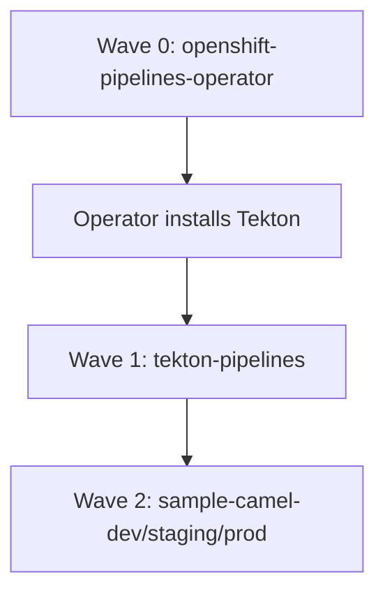

# End-to-end installation guide

Install the full stack on OpenShift using Argo CD (already present on the cluster).

Repository: [github.com/rmallam/openshift-pipelines-examples](https://github.com/rmallam/openshift-pipelines-examples)

## What gets installed

| Order | Component | Managed by | Namespace |
|-------|-----------|------------|-----------|
| 0 | OpenShift Pipelines **Operator** (OLM Subscription) | Argo CD app `openshift-pipelines-operator` | `openshift-operators` |
| 0 | Operator creates Tekton control plane + inbuilt tasks | Operator | `openshift-pipelines` |
| 1 | Pipelines, triggers, RBAC, PVC | Argo CD app `tekton-pipelines` | `cicd` |
| 2 | Sample Camel app (dev/staging/prod) | Argo CD ApplicationSet `sample-camel` | `sample-camel-*` |

Reference: [Red Hat OpenShift Pipelines installation](https://docs.redhat.com/en/documentation/red_hat_openshift_pipelines/latest/html/installing_and_configuring/installing-pipelines)

---

## Prerequisites

- OpenShift 4.x cluster with cluster-admin access
- **Argo CD** already installed (namespace `argocd` or OpenShift GitOps in `openshift-gitops`)
- Git access to this repository (public or register credentials in Argo CD)
- `oc` CLI logged in as cluster-admin for bootstrap steps

---

## Step 1 — Grant Argo CD permission to install operators

Argo CD needs OLM permissions to create the OpenShift Pipelines Subscription. Apply once:

```bash
oc apply -f argocd/rbac/argocd-olm.yaml
```

If Argo CD runs in a custom namespace, edit the `subjects` in that file first.

---

## Step 2 — Register the Git repository in Argo CD

Skip if the repo is public.

```bash
# Argo CD CLI
argocd repo add https://github.com/rmallam/openshift-pipelines-examples.git \
  --username rmallam \
  --password <github-personal-access-token>

# Or OpenShift GitOps: add repository via console or cluster secret
```

---

## Step 3 — Bootstrap the App-of-Apps

This single command hands off operator + pipelines + workloads to Argo CD:

```bash
oc apply -f argocd/root-application.yaml
```

Argo CD creates (via sync waves):

1. **AppProject** `tekton`
2. **Application** `openshift-pipelines-operator` → OLM Subscription
3. **Application** `tekton-pipelines` → Pipeline CRs, triggers, Route
4. **ApplicationSet** `sample-camel` → dev / staging / prod apps

Watch progress:

```bash
# Argo CD UI or CLI
argocd app list
argocd app get openshift-pipelines-operator --refresh
argocd app get tekton-pipelines --refresh
```

Or with `oc`:

```bash
oc get applications -n argocd
oc get subscription openshift-pipelines-operator -n openshift-operators -w
```

---

## Step 4 — Wait for the operator

The operator typically takes 2–5 minutes. Verify:

```bash
# Subscription active
oc get subscription openshift-pipelines-operator -n openshift-operators \
  -o jsonpath='{.status.state}{"\n"}'

# TektonConfig ready
oc get tektonconfig

# Control plane pods
oc get pods -n openshift-pipelines

# Inbuilt tasks (used by our pipelines)
oc get tasks -n openshift-pipelines | head
```

Expected tasks include: `git-clone`, `buildah`, `maven`, `openshift-client`.

Pin operator version (optional): edit `operators/openshift-pipelines/subscription.yaml`:

```yaml
spec:
  channel: pipelines-1.17   # instead of latest
```

See `config/operators.yaml` for reference.

---

## Step 5 — Confirm Argo CD synced pipelines

Once the operator is healthy, `tekton-pipelines` should sync automatically (retries enabled).

```bash
oc get pipeline -n cicd
oc get eventlistener -n cicd
oc get route tekton-webhook -n cicd
```

If sync fails with CRD not found, wait for the operator and refresh:

```bash
argocd app sync tekton-pipelines --force
```

---

## Step 6 — Create secrets (manual, not in Git)

```bash
# GitHub webhook HMAC secret
oc create secret generic github-webhook-secret \
  --from-literal=secretToken=$(openssl rand -hex 20) \
  -n cicd

# Argo CD API token for dev deploy trigger
argocd account generate-token --account <account-with-sync-permission>
oc create secret generic argocd-token \
  --from-literal=token=<token> \
  -n cicd
```

Examples: `config/github-webhook-secret.example.yaml`, `config/argocd-token-secret.example.yaml`

---

## Step 7 — Configure GitHub webhook

```bash
WEBHOOK_URL=$(oc get route tekton-webhook -n cicd -o jsonpath='https://{.spec.host}')
echo "Payload URL: ${WEBHOOK_URL}"
echo "Secret: (same as secretToken from step 6)"
```

In GitHub → **Settings → Webhooks → Add webhook**:

| Field | Value |
|-------|-------|
| Payload URL | route URL above |
| Content type | `application/json` |
| Secret | `secretToken` value |
| Events | **Just the push event** |

### Automatic triggers

| Trigger | Branch | Paths | Action |
|---------|--------|-------|--------|
| `sample-camel-build` | any | `apps/sample-camel/**` | Build + test + push image |
| `sample-camel-dev-deploy` | `main` only | `apps/sample-camel/**`, `deploy/kustomize/overlays/dev/**` | Argo CD sync dev app |

---

## Step 8 — Verify the full stack

```bash
chmod +x scripts/verify-install.sh
./scripts/verify-install.sh
```

Or test manually:

```bash
# Trigger a build via webhook (push to apps/sample-camel) or:
oc create -f pipelines/pipelineruns/sample-camel-build-dev.yaml -n cicd

# Watch
tkn pipelinerun list -n cicd
tkn pipelinerun logs -f -n cicd -l app.kubernetes.io/name=sample-camel

# Check dev app
oc get pods -n sample-camel-dev
curl -k "$(oc get route -n sample-camel-dev -o jsonpath='https://{.items[0].spec.host}' 2>/dev/null)/api/hello"
```

---

## Sync wave order (Argo CD)



---

## Troubleshooting

### Operator Subscription stuck

```bash
oc describe subscription openshift-pipelines-operator -n openshift-operators
oc get installplan -n openshift-operators
oc get csv -n openshift-operators | grep pipelines
```

Ensure `redhat-operators` catalog exists:

```bash
oc get catalogsource redhat-operators -n openshift-marketplace
```

### Argo CD cannot create Subscription

Re-apply RBAC from step 1. Check application-controller logs:

```bash
oc logs -n argocd -l app.kubernetes.io/name=argocd-application-controller --tail=50
```

### tekton-pipelines app sync fails (CRD not found)

Operator not ready yet. Wait and retry:

```bash
oc get tektonconfig
argocd app sync tekton-pipelines
```

### Webhook returns 404 / connection refused

```bash
oc get eventlistener tekton-webhook -n cicd
oc get pods -n cicd -l eventlistener=tekton-webhook
oc get route tekton-webhook -n cicd
```

Ensure Tekton Triggers is installed (included with OpenShift Pipelines operator).

### Build fails — task not found

```bash
oc get tasks -n openshift-pipelines
```

Pipelines use the cluster resolver pointing at `openshift-pipelines` namespace tasks.

---

## Uninstall

Remove in reverse order:

```bash
oc delete application tekton-root -n argocd
oc delete subscription openshift-pipelines-operator -n openshift-operators
# Operator uninstalls Tekton; remove remaining namespaces if needed
oc delete ns cicd sample-camel-dev sample-camel-staging sample-camel-prod
```

---

## Configuration reference

| File | Purpose |
|------|---------|
| `config/operators.yaml` | Operator channel and verification commands |
| `config/argocd.yaml` | Argo CD repo URL and app names |
| `config/environments.yaml` | Per-environment namespaces and paths |
| `config/triggers.yaml` | Webhook trigger rules |
